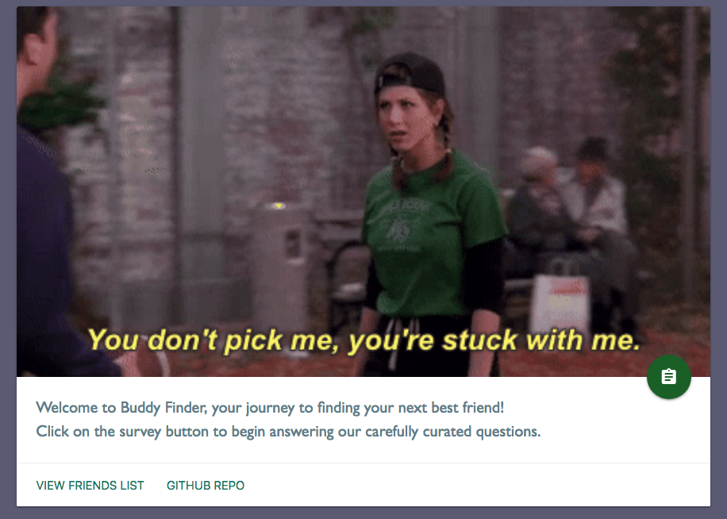
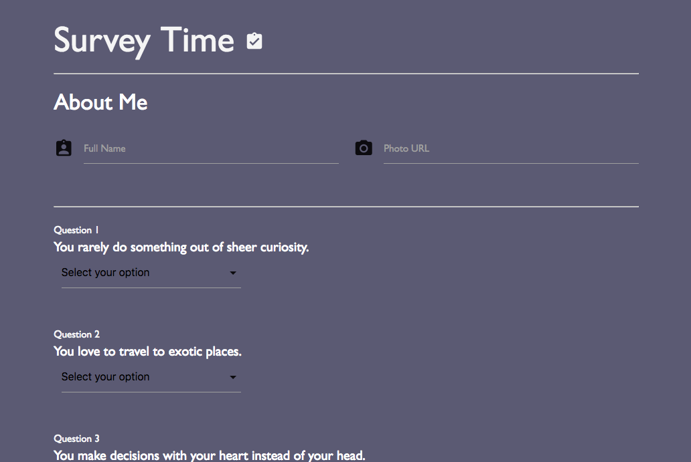

# Buddy-Find

The goal is to create a Friend Finder app (essentially a dating app but for friends) using Node and Express servers. The user enters a page that leads to a survey. When the user submits the survey, they are matched with a "friend" that has the closest match to their personality.

## Getting Started
[Click here to view the survey](https://morning-chamber-41149.herokuapp.com/)

## Preview

## Technologies used

- express NPM Package - https://www.npmjs.com/package/express
- path NPM Package - https://www.npmjs.com/package/path
- body parser NPM Package - https://www.npmjs.com/package/body-parser

### Prerequisites

- Node.js - Download the latest version of Node https://nodejs.org/en/
- Materialize - Add CDN link to HTML http://materializecss.com/getting-started.html

## Built With

* Visual Studio Code - Text Editor
* Materialize - Wireframe

## Authors

* **Sandy Yeung** - *HTML/JS/Node.js* - [Github](https://github.com/Sandynism)